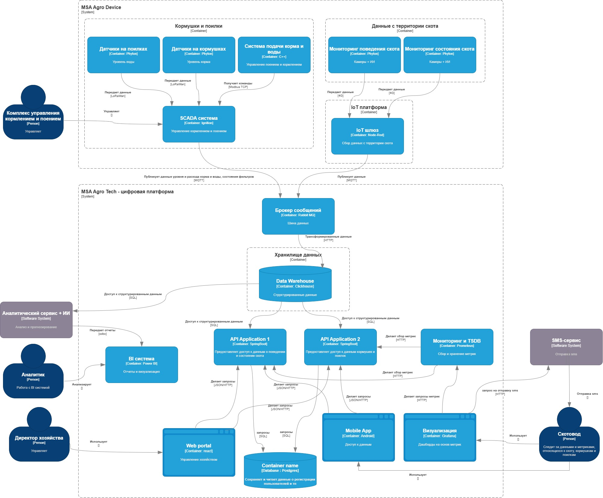
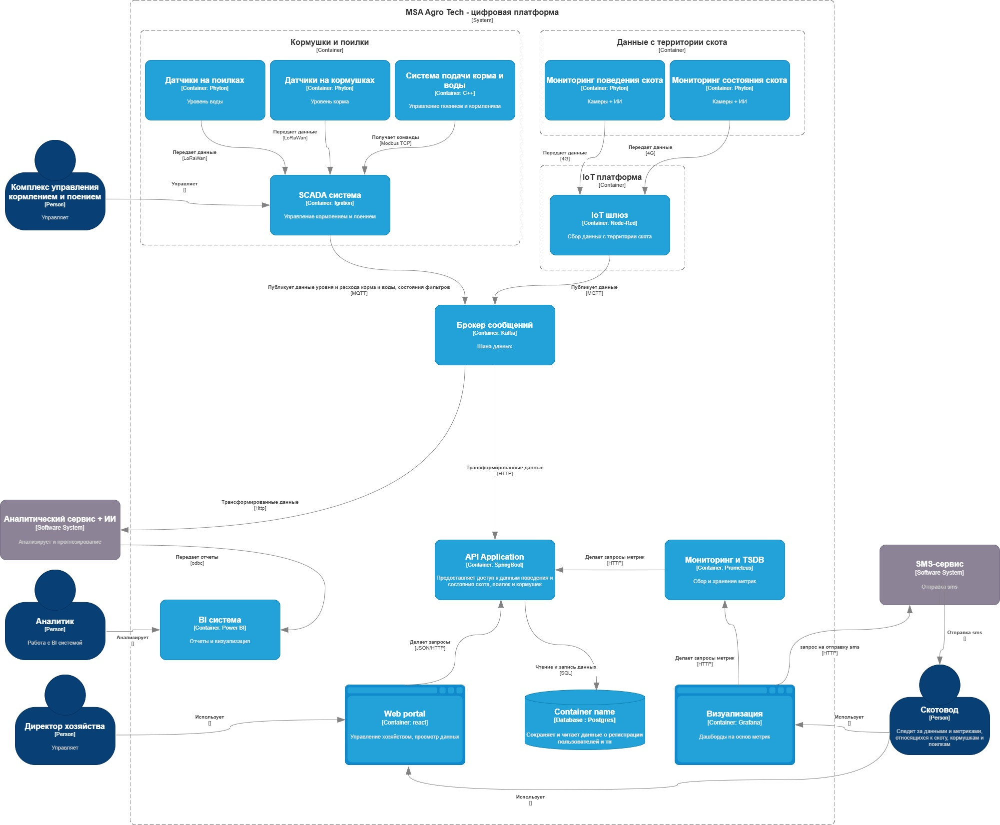

# ADR-2: Ограниченные контексты и микросервисы

**Статус:**  ⚠️ На рассмотрении   
**Участники:** Бражников М. С.
**Дата:** <2026-02-26>  

---

## 1. Контекст
<Необходимо определить ограниченные контексты микросервисов в системе>

## 2. Микросервисы системы

|       | Актор                                  | Действие                              | Требование                                                                                                       | Обоснование                                                                                                                  |
|-------|----------------------------------------|---------------------------------------|------------------------------------------------------------------------------------------------------------------|------------------------------------------------------------------------------------------------------------------------------|
| C-001 | Брокер сообщений (RabbitMQ)            | получает и передает данные            | система должна   передавать информацию с датчиков кормушек, поилок и территории скота в шину данных          | Простота использования, мониторинга и настрофки, интеграция с устройствами                                                   |
| C-002 | Хранилище данных (Clickhose)           | получает и преобразует данные         | система должна   хранить обработанные данные в хранилище для дальнейшего использования                       | Может Справляться с аналитическими нагрузками                                                                                |
| C-003 | Api Application 1 (Spring Boot)        | предоставляет доступ к данным         | система должна   предоставлять доступ к данным, относящихся к поведению и состоянию скота                    | Экспертиза команды, простота и скорость создания приложений(стартеры, автоконфиги и тп)                                      |
| C-004 | Api Application 2 (Spring Boot)        | предоставляет доступ к данным         | система должна   предоставлять доступ к данным, относящихся к кормушкам и поилкам                            | Экспертиза команды, простота и скорость создания приложений(стартеры, автоконфиги и тп)                                      |
| C-005 | Мониторинг и TSDB (Prometheus)         | собирает и хранит метрики             | система должна   фиксировать метрики, относящиеся к кормушкам , поилкам , состоянию и поведению скота        | пулл-модель(опрашиват эндпойнты, возможность интеграции со spring boot)                                                      |
| C-006 | Web portal (react)                     | запрашивает и визуализирует данные    | система должна   визуализировать данные, относящиеся к кормушкам , поилкам , состоянию и поведению скота     | проверенная технология, покрывает 100% наших потребностей                                                                    |
| C-007 | Mobile app (Android)                   | запрашивает и визуализирует данные    | система должна   визуализировать данные, относящиеся к кормушкам , поилкам , состоянию и поведению скота     | проверенная технология, покрывает 100% наших потребностей                                                                    |
| C-008 | Визуализация (Grafana)                 | запрашивает и визуализирует метрики   | система должна   визуализировать метрики, относящиеся к кормушкам , поилкам , состоянию и поведению скота    | удобный ui, готовые дашборды, бесплатная версия покрывает 100% наших потребностей                                            |
| C-009 | BI система (Power BI)                  | визуализация аналитических отчетов    | система должна   визуализировать аналитические отчеты                                                        | Интегрируется с ClickHouse, Производительность на больших данных, Поддержка реального времени                                                           |
| C-010 | IoT-шлюз (Node-RED)                    | преобразует и передает данные с камер | система должна   преобразовывать данные с камер для дальнейшей обработки                                     | Поддержка промышленных протоколов, интеграция с RabbitMQ, возможность автономной работы                                      |
| C-011 | Мониторинг поведения скота (Камеры+ИИ) | фиксирует тип поведения скота         | система должна   фиксировать тип поведения скота                                                             | Технология позволяет обнаруживать различные отклонения в поведении и состоянии скота, мониторинг в разных зонах, окупаемость |
| C-012 | Мониторинг состояния скота (Камеры+ИИ) | фиксирует тип состояний скота         | система должна   фиксировать тип состояния скота                                                             |                                                                                                                              |
| C-013 | Датчики на поилках ()                  | фиксирует уровень и расход воды       | система должна   фиксировать уровень и расход воды и состояние фильтров воды                                 |                                                                                                                              |
| C-014 | Датчики на кормушках ()                | фиксирует уровень и расход корма      | система должна   фиксировать уровень и расход корма                                                          |                                                                                                                              |
| C-015 | Система подачи корма и воды ()         | пополняет уровень корма и воды        | система должна   уметь автоматически пополнять уровни корма и воды                                           |                                                                                                                              |
| C-016 | SCADA-система (Ignition)               | управляет подачей корма и водя        | система должна   уметь управлять уровнем корма и воды                                                        | Поддержка промышленных протоколов, небольшая стоимость внедрения, контроль и управление параметрами среды                    |
| C-017 | Аналитический сервис + ИИ              | анализирует и прогнозирует            | система должна   уметь анализировать, прогнозировать данные и передавать отчеты                              |                                                                                                                              |
| C-018 | Sms-сервис                             | отправляет сообщение                  | система должна   уметь оповещать скотовода о параметрах, которые достигли или близки к критическому значению |                                                                                                                              |

## 3. Интеграции 

|         | Иинициатор                              | Исполнитель/получатель         | Тип интеграции | Обоснование выбора интеграции                                                      |
|---------|-----------------------------------------|--------------------------------|----------------|------------------------------------------------------------------------------------|
| INT-001 | Брокер сообщений (RabbitMQ)             | Хранилище данных (Clickhose)   | Sync HTTP      | простота реализации, независимость сервисов, отказоустойчивость                    |
| INT-002 | Api Application 1                       | Хранилище данных (Clickhose)   | Sync SQL       | обеспечивает доступ к структурированным данным                                     |
| INT-003 | Api Application 2                       | Хранилище данных (Clickhose)   | Sync SQL       | обеспечивает доступ к структурированным данным                                     |
| INT-004 | Визуализация (Grafana)                  | Мониторинг и TSDB (Prometheus) | Sync HTTP/REST | простота реализации, независимость сервисов, отказоустойчивость                    |
| INT-005 | Мониторинг и TSDB (Prometheus)          | Api Application 1              | Sync HTTP/REST | простота реализации, независимость сервисов, отказоустойчивость                    |
| INT-006 | Мониторинг и TSDB (Prometheus)          | Api Application 2              | Sync HTTP/REST | простота реализации, независимость сервисов, отказоустойчивость                    |
| INT-007 | Mobile app (Android)                    | Api Application 1              | Sync HTTP/REST | простота реализации, независимость сервисов, отказоустойчивость                    |
| INT-008 | Web portal (react)                      | Api Application 2              | Sync HTTP/REST | простота реализации, независимость сервисов, отказоустойчивость                    |
| INT-009 | Аналитический сервис + ИИ               | Хранилище данных (Clickhose)   | Sync SQL       | обеспечивает доступ к структурированным данным                                     |
| INT-010 | Аналитический сервис + ИИ               | BI система (Power BI)          | Sync HTTP/REST | простота реализации, независимость сервисов, отказоустойчивость                    |
| INT-011 | Мониторинг поведения скота (Камеры+ИИ)  | IoT-шлюз (Node-RED)            | 4G             | Покрытие в удаленных районах, энергоэффективность, Надежность и отказоустойчивость |
| INT-012 | Мониторинг состояния скота (Камеры+ИИ)  | IoT-шлюз (Node-RED)            | 4G             | Покрытие в удаленных районах ,энергоэффективность,Надежность и отказоустойчивость  |
| INT-013 | IoT-шлюз (Node-RED)                     | Брокер сообщений (RabbitMQ)    | MQTT           | легковесный publish-subscribe протокол                                             |
| INT-014 | Датчики на поилках ()                   | SCADA-система (Ignition)       | LoRaWan        | Совместимость с существующими IoT-шлюзами, автономность                            |
| INT-015 | Датчики на кормушках ()                 | SCADA-система (Ignition)       | LoRaWan        | Совместимость с существующими IoT-шлюзами, автономность                            |
| INT-016 | SCADA-система (Ignition)                | Брокер сообщений (RabbitMQ)    | Sync MQTT      | легковесный publish-subscribe протокол                                             |
| INT-017 | SCADA-система (Ignition)                | Система подачи корма и воды    | TCP            |                                                                                    |

### Нефункциональные требования
| Категория                  | Требование                                                        | Критичность |
|----------------------------|-------------------------------------------------------------------|-------------|
| отказоустойчивость         | 99,95%                                                            | средняя     |
| расширяемость              | возможность создать новый функционал без изменения существуещего  | высокая     |
| высокую производительность | время отклика не более 5 сек при возникновении нештатной ситуации | высокая     |
| время реакции              | реакция в реальном времени для систем видеоаналитики              | высокая     |

---

## 4. Решение

### Описание
Принято решение и создании системы в контексте вышеописанных требований.

<figure style="text-align: center;">
<figcaption>Основное решение</figcaption>

</figure>

#### Последствия

**✅ Положительные:**
- Данный подход олностью покрывает требования к системе
- Отдельные миросервисы (Application 1 - для поведения и состояния скота) и (Application 2 - для данных касательно кормушек и поилок) обеспечивают гибкость в использовании , разделение функционала и возможность распределния задач между командами
- Доступ к данным происходит через вэб-портал, мобильное приложение, а также систему мониторинга Grafana , что увеличивает возможности мониторинга данных 
- Все микросервисы независимы друг от друга
- Отказоустойчивость повышена возможностью сохранения структурированных данных в Clickhouse

**⚠️ Негативные:**
- На разработку и внедрение уйдет много времени
- При очень большой нагрузке RabbitMQ вероятно не подойдет
- Нужно обучить команду разработке на Android, что займет время 
- Clickhouse сложен в проектировании и эксплуатации
- для реализации решения потребуется больше памяти и вычислительных ресурсов

---

### 4. Альтернативы

| Вариант                    | Плюсы                                                     | Минусы                                                                                                                                                                           | Почему отклонен                                                     |
|----------------------------|-----------------------------------------------------------|----------------------------------------------------------------------------------------------------------------------------------------------------------------------------------|---------------------------------------------------------------------|
| Кафка вместо RabbitMQ      | Логи хранятся длительное время                            | сложные поддержка и сопровождение                                                                                                                                                | для длительного хранения данные достаточно перебросить в clickhouse |
| Один API Application двух  | Меньше времени на разработку, меньше потребление ресурсов | нет четкого разделения контекстов, возможны проблемы с масштабированием                                                                                                          | масштабируемость и разделение контекстов в приоритете               |
| Отказ от Android app       | Меньше времени на разработку                              | отсутствует вариант мониторинга через мобильное устройство                                                                                                                       | доступность данных в приоритете                                     |
| Отказ от Clickhouse        | Меньше времени на разработку, меньше потребление ресурсов | уменьшает отказоустойчивость системы при потери соединений с api application, данные из брокера сообщений придется обрабатывать на стороне application и сохранять в базу данных | отказоустойчивость в приоритете                                     |

---
<figure style="text-align: center;">
<figcaption>Альтернативное решение</figcaption>

</figure>

### 5. Риски

1. **Нужна экспертиза Clickhouse, иначе могут появиться сложности в эксплуатации**  
   *Меры:* обучить команду или взять готового специалиста со стороны

2. **Вероятность больших нагрузок есть, хоть и небольшая, поэтому RabbitMQ может не справиться**  
   *Меры:* Быть готовыми быстро и бесшовно заменить RabbitMQ на Kafka 