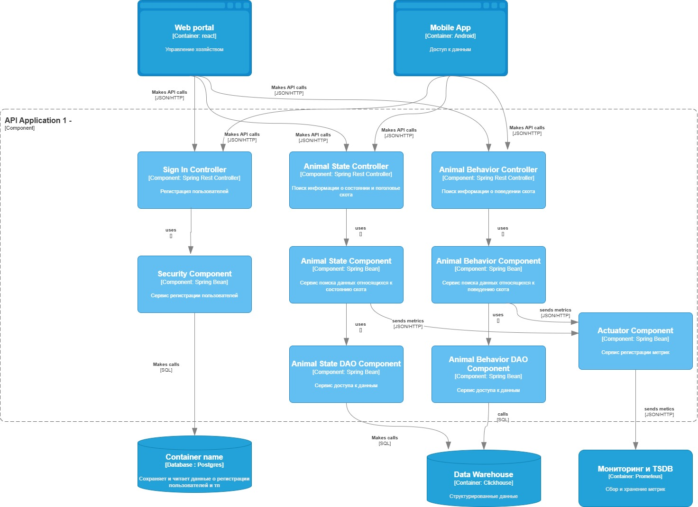
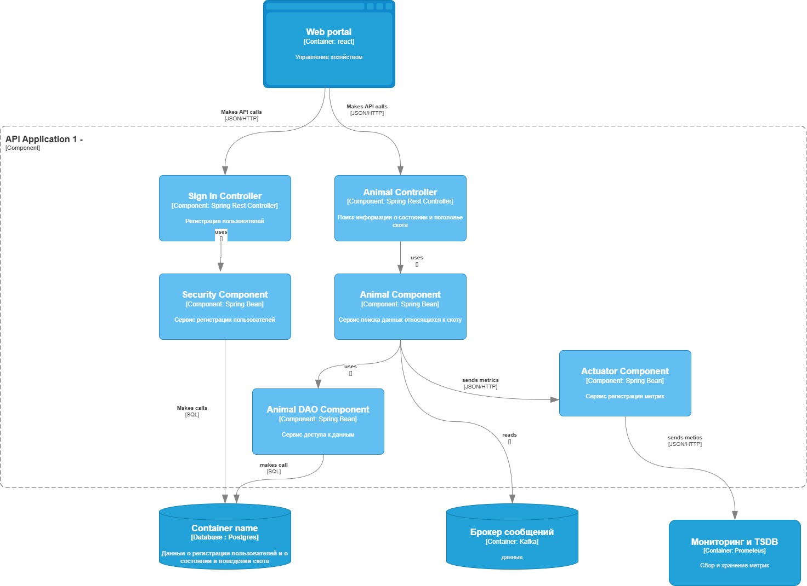

# ADR-3: Компоненты и код

**Статус:**  ⚠️ На рассмотрении   
**Участники:** Бражников М. С.
**Дата:** <2026-02-26>

---

## 1. Контекст
<Необходимо разработать внутренние компоненты приложения и их взаимосвязь>

## 2. Решение

### Описание
Принято решение и создании приложения в контексте вышеописанных требований.

<figure style="text-align: center;">
<figcaption>Основное решение</figcaption>

</figure>

<figure style="text-align: center;">
<figcaption>Альтернативное решение</figcaption>

</figure>

## 3. Критерии
#### 1 - Сложность реализации

#### Основное решение
Данные в структурированном виде уже хранятся в Clickhouse.
Происходит вычитка данных из Clickhouse только по запросам.
Clickhouse сложен в проектировании
Дополнительно надо реализовать мобильное приложение
(Высокая)

#### Альтернативное решение
Поскольку Clickhouse отсутствует, то нужен слушатель кафки, после 
вычитки из кафка нужны дополнительные конвертации и преобразования данных,
после чего необходимо сохранить данные в базу.
(Высокая)

#### 2 - Связность

#### Основное решение
Максимальное логическое разделение функционала по смыслу, каждый класс отвечат за
определенную функцию, также вместо одного микросервиса есть два (ApiApplication 1,2 один отвечает за данные про животных, другой за корм и воду), происходит разделение ответственности
(Высокая)

#### Альтернативное решение
Классы совмещают выполнение функций, весь функционал приложения реализован в рамках одного микросервиса
(Средняя)

#### 3 - Производительность

#### Основное решение
Два микросервиса(ApiApplication 1,2) вычитывают данные из Clickhouse по запросу и по расписанию,
(Высокая)

#### Альтернативное решение
Один микросервис постоянно вычитывает сообщения из кафка, преобразует и сохраняет в базу данных,
(Низкая/Средняя)

#### 4 - Устойчивость к сбоям

#### Основное решение
Два микросервиса (ApiApplication 1,2) - при отказе одного из них, второй продолжает работать.
Данные берутся из Clickhouse, поэтому при временном отказе кафка приложения продолжат работу
(Высокая)

#### Альтернативное решение
При отказе базы данных или кафка приложения не будут работать
(Низкая/Средняя)

#### 5 - Масштабируемость

#### Основное решение
Два микросервиса (ApiApplication 1,2) позволяют проводить горизонтальное масштабирование 
(Средняя)

#### Альтернативное решение
Один микросервис (ApiApplication) - масштабировать отдельные части не получится
(Низкая)

#### 6 - Потребление ресурсов

#### Основное решение
Дополнительные расходы ресурсов на Clickhouse и ApiApplication 1-2 (два микросервиса)
(Высокий)

#### Альтернативное решение
Одно приложение ApiApplication (один микросервис) и отсутствие Clickhouse позволяет сэкономить ресурсы
(Средний)

#### 7 - Наблюдаемость/мониторинг

#### Основное решение
Мониторинг при помощи метрик и логов
Дополнительно присутствует мобильное приложение
(Высокий)

#### Альтернативное решение
Мониторинг при помощи метрик и логов
(Средний)

#### 8 - Гибкость и поддерживаемость

#### Основное решение
Разделение бизнесс-функций(отвественности) по различным микросервисам, разделение
классов по их функционалу
(Высокий)

#### Альтернативное решение
Разделение бизнесс-функций(отвественности) менее выражено касательно приложений,
один микросервис(ApiApplication) для различных функций
(Средний)

### Сравнение критериев

| Критерий                    | Основное          | Альтернативное   |     |                                                                                                                  
|-----------------------------|-------------------|------------------|-----|
| сложность реализации        | высокая           | высокая          |     |
| связность                   | высокая (лучше)   | низкая/средняя   |     |
| производительность          | высокая (лучше)   | средняя          |     |
| устойчивость к сбоям        | высокая (лучше)   | низкая/средняя   |     |
| масштабируемость            | средняя (лучше)   | низкая           |     |
| потребление ресурсов        | высокая           | средняя (лучше)  |     |
| наблюдаемость               | высокая  (лучше)  | средняя          |     |
| гибкость и поддерживаемость | высокая  (лучше)  | средняя          |     |

Исходя из сравнения критериев можно сделать вывод что основной вариант нам подходит больше,
поскольку он удовлетворяет требованиям и имеет более качественные показатели по нескольким аспектам